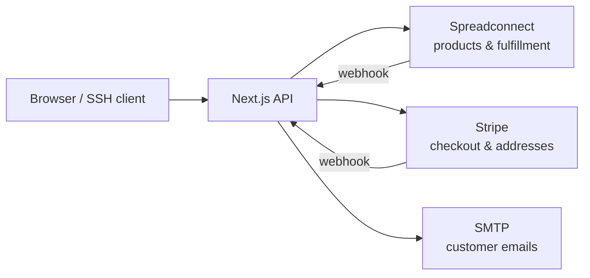

# shop.h4ks.com

Source code for the shop.h4ks.com merch store.



## Run locally

```bash
cp .env.example .env
# fill in the required vars (see .env.example)
docker compose --profile dev up
```

The `dev` profile starts:

- **shop** — the Next.js app
- **stripe-cli** — forwards Stripe webhooks to the shop; prints the `whsec_...` to paste into `.env`
- **tunnel** + **tunnel-init** — a free cloudflared quick-tunnel; the shop's entrypoint auto-picks the public URL as `SHOP_PUBLIC_URL`
- **webhook-init** — auto-registers the Spreadconnect webhook subscriptions against the current tunnel URL (idempotent, removes stale subs)

Open the printed tunnel URL (`https://*.trycloudflare.com`) in a browser, or `http://localhost:3005` if you only need the UI. Pay with Stripe test card `4242 4242 4242 4242`, any future date, any CVC for testing.

## Simulating Spreadconnect events

After placing a paid test order, grab its numeric Spreadconnect id from shop logs:

```bash
docker compose logs shop | grep "webhook: confirmed"
```

Then trigger each lifecycle event from the host:

```bash
npm run simulate -- processed <id>     # Order.processed
npm run simulate -- shipped <id>       # Shipment.sent — tracking email
npm run simulate -- cancelled <id>     # Order.cancelled — refund-contact email
npm run simulate -- lifecycle <id>     # processed → shipped
npm run simulate -- subs               # list registered subscriptions
```

Each command POSTs to Spreadconnect's `/orders/{id}/simulate/...` endpoint. Spreadconnect then delivers the webhook to your tunnel URL; the shop verifies the HMAC and sends the matching email.

`Order.needs-action` is real-prod-only — no simulate endpoint.

## Prerequisites

- **Spreadconnect** — log in at <https://login.spreadconnect.app>, go to Integrations → Spreadconnect API → Connect to get your API key. Publish at least one product, and add a payment method under Settings → Payment (required for fulfillment).
- **Stripe** — enable test mode at <https://dashboard.stripe.com>, grab the secret key from Developers → API keys. For production, prefer a **restricted API key** (`rk_live_...`) with scopes `Checkout Sessions: write`, `Customers: write`, and `Events: read` instead of a full secret key. Register a webhook endpoint at `/api/webhooks/stripe` for the `checkout.session.completed` event. Add an [IP allowlist](https://docs.stripe.com/ips) at the firewall/CDN level as defense-in-depth for the webhook route.
- **SMTP** — any real SMTP relay. Used for tracking / cancellation emails.
- **Logto** (optional) — create a Traditional Web app, set the redirect URI to `<your-domain>/api/auth/callback`. Without this, sign-in is disabled and the shop still works fine.

Env vars are documented in `.env.example`.
