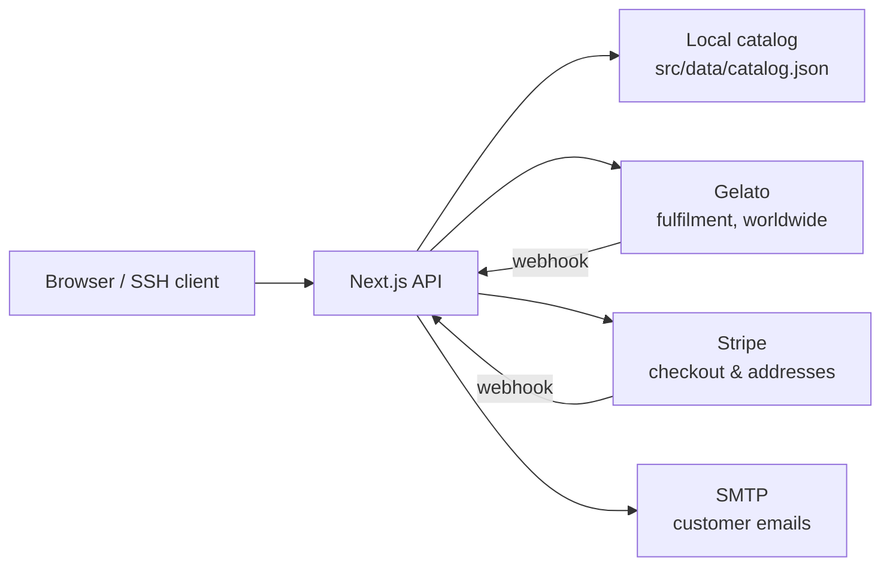

# shop.h4ks.com

Source code for the shop.h4ks.com merch store.


```mermaid
graph LR
    A[Browser / SSH client] --> B[Next.js API]
    B --> F[Local catalog\nsrc/data/catalog.json]
    B --> C[Gelato\nfulfilment, worldwide]
    B --> D[Stripe\ncheckout & addresses]
    D -->|webhook| B
    C -->|webhook| B
    B --> E[SMTP\ncustomer emails]
```

The shop owns its catalog locally (`src/data/catalog.json`) and uses **Gelato** for
fulfilment — a single global account that prints on demand and auto-routes each
order to the nearest facility, so it ships worldwide with no per-region split.

## Run locally

```bash
cp .env.example .env
# fill in the required vars (see .env.example)
docker compose --profile dev up
```

The `dev` profile starts:

- **shop** — the Next.js app
- **stripe-cli** — forwards Stripe webhooks to the shop; prints the `whsec_...` to paste into `.env`
- **tunnel** + **tunnel-init** — a free cloudflared quick-tunnel; the shop's entrypoint auto-picks the public URL as `SHOP_PUBLIC_URL`

Open the printed tunnel URL (`https://*.trycloudflare.com`) in a browser, or `http://localhost:3005` if you only need the UI. Pay with Stripe test card `4242 4242 4242 4242`, any future date, any CVC for testing.

## The product catalog

Products live in `src/data/catalog.json`, generated from declarative definitions in
`scripts/gelato-build-catalog.mjs`. Each product variant carries a Gelato
`productUid`; the artwork is a PNG under `public/designs/` that Gelato fetches by
URL at order time.

To change the catalog, edit the `PRODUCTS` array in the generator and re-run:

```bash
npm run gelato:build-catalog   # resolves Gelato productUids → src/data/catalog.json
npm run gelato:resolve         # helper: resolve one blank's productUid + price probe
```

`npm run gelato:build-catalog` reads `GELATO_TOKEN` and resolves a real Gelato
`productUid` for every variant. Prices in `catalog.json` are per-category
placeholders (Gelato's real price is destination-dependent) — refine them by
hand. Products with `needsArtwork: true` (no design file yet) are hidden from the
storefront until you add artwork.

## Order lifecycle

1. Checkout (`/api/checkout`) prices the cart against the local catalog and opens a Stripe Checkout Session.
2. On `checkout.session.completed`, the Stripe webhook maps each purchased SKU back to its Gelato `productUid` + print file and places a **Gelato order** (`orderType: "order"`).
3. Gelato webhooks (`order_status_updated`) drive the customer emails: `shipped` → tracking email, `canceled` → cancellation email.

### Gelato webhooks

Gelato has no webhook-registration API — configure it once in the Gelato
dashboard, pointing at `<your-domain>/api/webhooks/gelato`. Gelato doesn't sign
webhooks, so set `GELATO_WEBHOOK_SECRET` and append `?token=<value>` to the URL
you register; the route rejects callers without the matching token.

For local testing, point a dashboard webhook at your tunnel URL
(`<tunnel>/api/webhooks/gelato`) or use the dashboard's "send test notification".

## Prerequisites

- **Gelato** — sign up at <https://gelato.com>, create an API key under Settings → API (`GELATO_TOKEN`). One account ships worldwide; no payment method is needed to build/test (draft orders are never charged).
- **Stripe** — enable test mode at <https://dashboard.stripe.com>, grab the secret key from Developers → API keys. For production, prefer a **restricted API key** (`rk_live_...`) with scopes `Checkout Sessions: write`, `Customers: write`, and `Events: read` instead of a full secret key. Register a webhook endpoint at `/api/webhooks/stripe` for the `checkout.session.completed` event. Add an [IP allowlist](https://docs.stripe.com/ips) at the firewall/CDN level as defense-in-depth for the webhook route.
- **SMTP** — any real SMTP relay. Used for tracking / cancellation emails.
- **Logto** (optional) — create a Traditional Web app, set the redirect URI to `<your-domain>/api/auth/callback`. Without this, sign-in is disabled and the shop still works fine.

Env vars are documented in `.env.example`.
