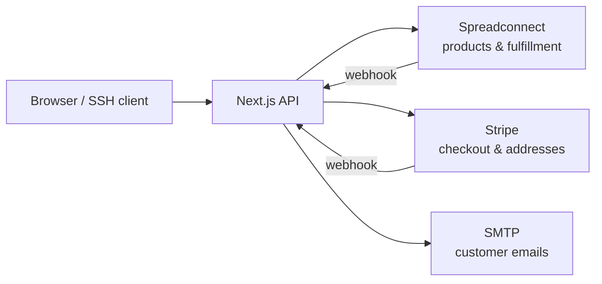

# shop.h4ks.com

Source code for the shop.h4ks.com merch store.


```mermaid
graph LR
    A[Browser / SSH client] --> B[Next.js API]
    B --> C[Spreadconnect\nproducts & fulfillment]
    B --> D[Stripe\ncheckout & addresses]
    D -->|webhook| B
    C -->|webhook| B
    B --> E[SMTP\ncustomer emails]
```

## Run locally

```bash
cp .env.example .env
# fill in the required vars (see .env.example)
docker compose --profile dev up
```

The `dev` profile starts:

- **shop** — the Next.js app
- **stripe-cli** — forwards Stripe webhooks to the shop; prints the `whsec_...` to paste into `.env`
- **tunnel** + **tunnel-init** — a free cloudflared quick-tunnel; the shop's entrypoint auto-picks the public URL as `SHOP_PUBLIC_URL`
- **webhook-init** — auto-registers the Spreadconnect webhook subscriptions against the current tunnel URL (idempotent, removes stale subs)

Open the printed tunnel URL (`https://*.trycloudflare.com`) in a browser, or `http://localhost:3005` if you only need the UI. Pay with Stripe test card `4242 4242 4242 4242`, any future date, any CVC for testing.

## Simulating Spreadconnect events

After placing a paid test order, grab its numeric Spreadconnect id from shop logs:

```bash
docker compose logs shop | grep "webhook: confirmed"
```

Then trigger each lifecycle event from the host:

```bash
npm run simulate -- processed <id>     # Order.processed
npm run simulate -- shipped <id>       # Shipment.sent — tracking email
npm run simulate -- cancelled <id>     # Order.cancelled — refund-contact email
npm run simulate -- lifecycle <id>     # processed → shipped
npm run simulate -- subs               # list registered subscriptions
```

Each command POSTs to Spreadconnect's `/orders/{id}/simulate/...` endpoint. Spreadconnect then delivers the webhook to your tunnel URL; the shop verifies the HMAC and sends the matching email.

`Order.needs-action` is real-prod-only — no simulate endpoint.

## Two Spreadconnect accounts (EU + US) — auth model

The shop is built around the EU Spreadconnect account today. Adding a US (NA) account is supported but uses a **different auth scheme** for two of the steps. To keep things sane there are exactly two kinds of credential:

| Credential                      | Where you get it                                                       | Where it lives                                                                             | TTL                                 |
| ------------------------------- | ---------------------------------------------------------------------- | ------------------------------------------------------------------------------------------ | ----------------------------------- |
| **SC API token** (per account)  | Dashboard → Integrations → Spreadconnect API → Connect                 | `.env` as `SPREADCONNECT_TOKEN` (runtime) + `SC_SYNC_EU_TOKEN` / `SC_SYNC_US_TOKEN` (sync) | Permanent until revoked             |
| **Dashboard session** (EU only) | Logging in at <https://login.spreadconnect.app> via `npm run sc:login` | `data/sc-dashboard-session.json` (gitignored)                                              | Hours to days — re-run when expired |

Why the second one exists: the SC public REST API exposes article _prices_ and _variants_ but not the _design references_ needed to recreate an article on a different account. The dashboard's internal API (`admin.spreadconnect.app/fulfillment/sam/...`) does expose them, but it authenticates with an `x-auth-token` header issued after a regular browser login. So `npm run sc:login` opens a real browser, you log in once, and the session is saved locally for the migration scripts to reuse.

### Refresh the dashboard session

```bash
npm run sc:login
```

Browser opens → log in → the moment you land on the dashboard the script saves cookies + localStorage to `data/sc-dashboard-session.json` and closes. No password is stored anywhere on disk.

You'll see `403`/`401` from `npm run discover:eu` if the session has expired — just run `sc:login` again.

### Backup everything from the EU account

Two commands, in this order:

```bash
npm run sc:login        # if your session has expired (or first time)
npm run discover:eu     # writes the catalog AND downloads every design
```

After running, you have a fully offline backup of the EU catalog:

- `data/sc-backup/eu-<ts>.json` — raw article snapshot from the public API (run `npm run backup:sc` separately if you also want this)
- `data/sc-eu-catalog.json` — articles + design references + variant prices + placement coords
- `data/sc-designs/<lookupId>.png` — every original design PNG, downloaded from SC's CDN

If SC ever loses or rotates those CDN URLs, the local PNGs are still your source of truth — re-upload from disk via the sync tool.

## Syncing the catalog to a US Spreadconnect account

If you also run a North-America Spreadconnect account, you can mirror the EU catalog (designs + articles) onto it. The sync reads `data/sc-eu-catalog.json` (produced by `discover:eu`) — so back up first, then:

```bash
npm run dump:product-types           # one-time: fetch both regions' productTypes
# (now hand-edit data/sc-product-type-map.json — see below)
npm run sync:sc -- --dry-run         # preview planned payloads
npm run sync:sc                      # apply changes
npm run sync:sc -- --force           # re-sync even if hash matches
npm run sync:sc -- --prune-orphans   # delete US articles no longer on EU
```

EU is the source of truth; each run reconciles US to match. Idempotent and crash-safe — state is persisted to `data/sc-sync-state.json` after each successful article.

### Why the manual product-type map

EU and US Spreadconnect catalogs use **completely disjoint product-type ids** (different printers, different brands, different stock). The EU `Men's T-Shirt | Gildan` is `productTypeId: 6` (SOL'S), the US equivalent is `productTypeId: 210` (Jerzees). Designs upload cross-account fine, but each article needs you to pick the closest US equivalent product type, and then map each EU appearance/size id to the corresponding US one.

`npm run dump:product-types` fetches both regions' full catalogs, scores candidate matches by name overlap, and writes three files:

- `data/sc-product-types-eu.json` / `sc-product-types-us.json` — raw catalogs
- `data/sc-product-types-side-by-side.csv` — readable diff: each EU product type used by your catalog, plus the top-5 US candidates by name overlap
- `data/sc-product-type-map.json` — the file the sync consumes. Seeded with empty stubs for every EU productTypeId you actually use. Edit it in place:

```json
{
  "6": {
    "_eu_name": "Men's T-Shirt | Gildan",
    "us_productTypeId": 210,
    "appearances": { "2": "5", "11": "6" },
    "sizes": { "2": "12", "3": "13", "4": "14" },
    "printAreas": {}
  }
}
```

The sync skips any article whose source productType isn't filled in, with a clear message pointing back here. All four files are gitignored — they're account-pair-specific and you build them once per pair.

**Required env vars** (sync-only, NOT used by the running shop):

Direction is explicit — `SOURCE` is read-only, `TARGET` is the account that gets modified.

| Var                      | Purpose                                   |
| ------------------------ | ----------------------------------------- |
| `SC_SYNC_SOURCE`         | which account to read from (default `EU`) |
| `SC_SYNC_TARGET`         | which account to write to (default `US`)  |
| `SC_SYNC_EU_TOKEN`       | API token for the EU account              |
| `SC_SYNC_US_TOKEN`       | API token for the NA account              |
| `SC_EUR_TO_USD`          | FX rate at sync time (default `1.08`)     |
| `SC_US_PRICE_MULTIPLIER` | extra target-side markup (default `1.0`)  |
| `SC_US_PRICE_ROUND`      | `cents` (default) or `ninety_nine`        |

Keep the sync tokens out of production env — they're higher-trust than the runtime `SPREADCONNECT_TOKEN` (sync deletes & creates articles). They're picked up from `.env` via `node --env-file=.env`.

Limitations:

- SC has no PATCH/PUT on articles, so any change deletes and recreates the US article (new US article id). The state file tracks the latest mapping.
- Designs upload by URL (cross-account-friendly) and are cached in state so re-running skips already-uploaded artwork.

## Refreshing shipping rates

Spreadconnect's per-country shipping tariffs change occasionally. Re-scrape both the EU and US calculators with:

```bash
npm run scrape:shipping
```

Outputs:

- `data/shipping-rates.csv` — one row per `(region, country, method, tier)` with currency column (`EUR` for EU rows, `USD` for US rows — prices are **not converted**).
- `data/shipping-rates.json` — raw structured data.

Runs Playwright headless, ~2-3 min for both regions. Use as the source of truth when updating `src/lib/shipping-zones.ts` or trimming Stripe's `allowed_countries`.

## Prerequisites

- **Spreadconnect** — log in at <https://login.spreadconnect.app>, go to Integrations → Spreadconnect API → Connect to get your API key. Publish at least one product, and add a payment method under Settings → Payment (required for fulfillment).
- **Stripe** — enable test mode at <https://dashboard.stripe.com>, grab the secret key from Developers → API keys. For production, prefer a **restricted API key** (`rk_live_...`) with scopes `Checkout Sessions: write`, `Customers: write`, and `Events: read` instead of a full secret key. Register a webhook endpoint at `/api/webhooks/stripe` for the `checkout.session.completed` event. Add an [IP allowlist](https://docs.stripe.com/ips) at the firewall/CDN level as defense-in-depth for the webhook route.
- **SMTP** — any real SMTP relay. Used for tracking / cancellation emails.
- **Logto** (optional) — create a Traditional Web app, set the redirect URI to `<your-domain>/api/auth/callback`. Without this, sign-in is disabled and the shop still works fine.

Env vars are documented in `.env.example`.
